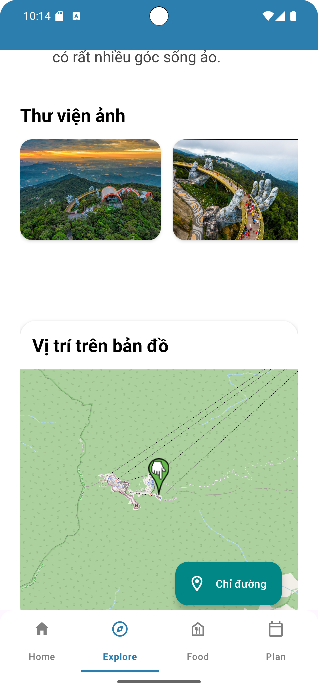
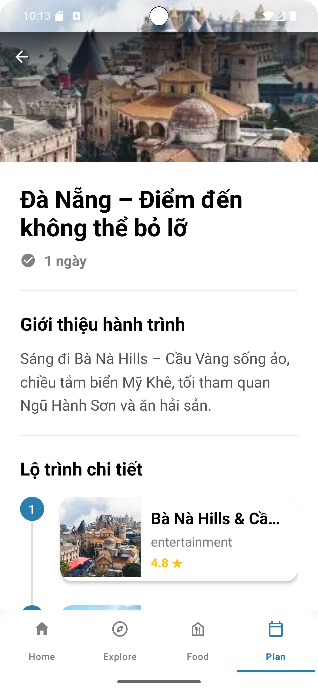

✈️ Travel VN - Ứng dụng Du lịch Thông minh
Travel Việt Nam là ứng dụng hỗ trợ khách du lịch tra cứu thông tin điểm đến, khám phá ẩm thực địa phương và tham khảo lịch trình tham quan tại Việt Nam. Dự án được xây dựng theo kiến trúc MVVM, tập trung vào trải nghiệm mượt mà trên nhiều thiết bị.

✨ Tính năng chính (Key Features)

🏠 Trang chủ (Home):

  Banner trượt (Slider) giới thiệu các địa điểm nổi bật.

    Danh sách gợi ý các điểm đến hấp dẫn (Recommend Places), các món ăn và các kế hoạch du lịch đặc sắc

    Giao diện tương thích (Responsive) với mọi kích thước màn hình nhờ thư viện SDP/SSP.

📍 Chi tiết địa điểm (Location Detail):

     Hiển thị thông tin chi tiết: Hình ảnh, mô tả, đánh giá.

  Tích hợp:

    🍜 Ẩm thực (Foods): Gợi ý món ngon đặc sản tại địa điểm đó.

    🗺 Lịch trình (Itinerary): Gợi ý lộ trình tham quan phù hợp.

     Điều hướng mượt mà với Navigation Component.

🔎 Truy cập nhanh (Quick Access):

    Tìm kiếm và truy cập nhanh các địa điểm theo danh mục hoặc từ khóa.

🎨 Trải nghiệm người dùng (UX):

    Splash Screen: Màn hình chào ấn tượng với hiệu ứng hoạt hình Lottie.

    Responsive Text: Hỗ trợ hiển thị tốt ngay cả khi người dùng bật chế độ "Chữ lớn" (Large Text) trên điện thoại.

🛠 Công nghệ sử dụng (Tech Stack)
Dự án sử dụng ngôn ngữ Kotlin và bộ công cụ Android Jetpack:

🏗 Kiến trúc (Architecture)
    MVVM (Model-View-ViewModel): Tách biệt logic xử lý và giao diện người dùng.

    Dependency Injection: Sử dụng Hilt để quản lý các thành phần, giúp code gọn gàng và dễ bảo trì.

    Single Activity: Thiết kế ứng dụng với 1 Activity duy nhất chứa nhiều Fragment.

📚 Thư viện & Công cụ (Libraries)
  Android Jetpack:

    Navigation Component: Quản lý điều hướng và truyền dữ liệu (Safe Args).

    ViewModel & LiveData: Quản lý trạng thái UI và vòng đời ứng dụng.

    ViewBinding: Thay thế findViewById giúp truy cập View an toàn hơn.

  Giao diện & Hiệu ứng:

    SDP & SSP: Thư viện hỗ trợ đa màn hình (tự động co giãn kích thước View và Text theo tỉ lệ màn hình).

    Lottie Animation: Hiển thị hình ảnh động vector chất lượng cao (Splash Screen).

    Glide: Tải và hiển thị hình ảnh từ Internet tối ưu bộ nhớ.

    Xử lý bất đồng bộ:

    Coroutines: Xử lý tác vụ nền (Load data) mượt mà, không gây đứng máy.

📂 Cấu trúc thư mục (Project Structure)
com.example.travelappandroid
├── di                    
│   ├── Appmodule                
│   ├── DataSourceModule     
│   ├── MyApplication     
│   └── RepositoryModule                       
├── ui                    
│   ├── components                
│   ├── detail      
│   ├── explore      
│   ├── food       
│   ├── home    
│   ├── itinerary   
│   ├── main    
│   ├── quick_place    
│   └── splash        
├── data                  
│   ├── dao        
│   ├── database      
│   ├── entity     
│   ├── local     
│   ├── mapper     
│   ├── model      
│   ├── remote      
│   └── repository       
└── utils                
📱 Screenshots

👨‍💻 Tác giả (Author)
Họ và tên: [Nguyễn Việt Anh]
Liên hệ: [kotenvietx72@gmail.com]
Dự án: Dự án cá nhân
